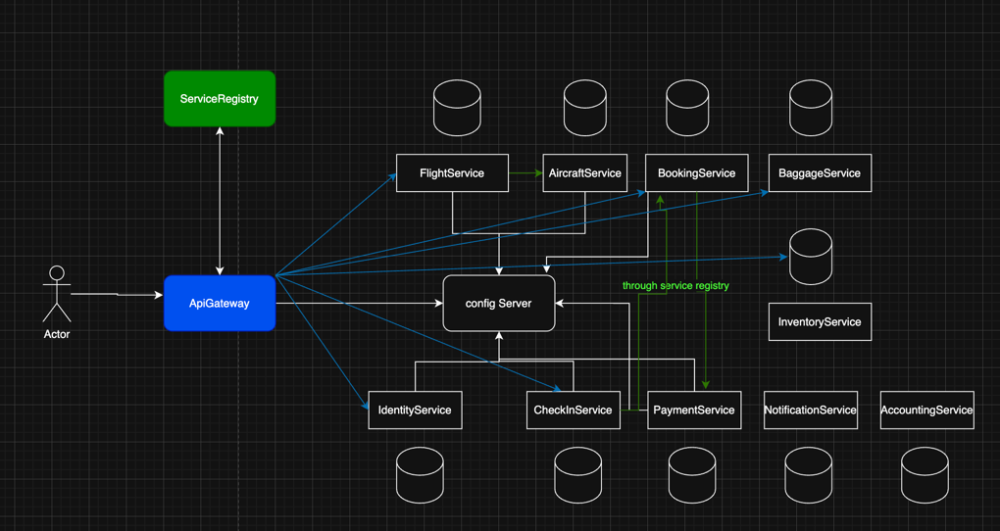

# ✈️ SkyReserve - Microservices-based Flight Reservation System

SkyReserve is a distributed flight booking system developed using **Spring Boot**, **Spring Cloud**, and **Docker**.  
It covers all major processes in a modern airline booking application: flight search, booking, check-in, baggage, payments, and more.

---

## 🧱 Architecture
SkyReserve follows a microservices architecture and includes the following services:



| Service             | Description                                           |
|---------------------|-------------------------------------------------------|
| `ApiGateway`        | Entry point for all requests, routes to services      |
| `ServiceRegistry`   | Eureka server for service discovery                   |
| `ConfigServer`      | Centralized configuration management                  |
| `FlightService`     | Manage flights, routes, schedules                     |
| `AircraftService`   | Aircraft details (type, capacity, etc.)               |
| `BookingService`    | Handle passenger bookings                             |
| `BaggageService`    | Manage passenger luggage and baggage tags             |
| `InventoryService`  | Track seat availability per flight                    |
| `CheckInService`    | Passenger check-in process                            |
| `PaymentService`    | Process online payments                               |
| `NotificationService`| Send emails/SMS notifications to users               |
| `AccountingService` | Invoice and financial management                      |
| `IdentityService`   | User authentication and account management            |


---
## 📡 API Endpoints
### 🎛️ FlightService - Flight Management & Search

| Method   | Endpoint                      | Description                                                 | Parameters                                                                                      |
|----------|-------------------------------|-------------------------------------------------------------|-------------------------------------------------------------------------------------------------|
| `GET`    | `/flights`                    | Retrieve all available flights                              | —                                                                                               |
| `GET`    | `/flights/search`             | Search flights by origin, destination, date, and passengers  | `departureCity` (opt), `arrivalCity` (opt), `date` (opt, ISO format), `numberOfPassengers` (opt) |
| `GET`    | `/flights/{id}`               | Get details of a specific flight by ID                       | `id` (required, Long)                                                                           |
| `GET`    | `/flights/{id}/price`         | Get the price of a specific flight by ID                     | `id` (required, Long)                                                                           |
<br>
✅ Les données dynamiques comme le nombre de sièges disponibles (availableSeats) sont récupérées depuis le InventoryService via un appel interne dans le FlightService.

---

## 🚀 How to Run

### 🐳 With Docker Compose

```bash
docker-compose up --build
