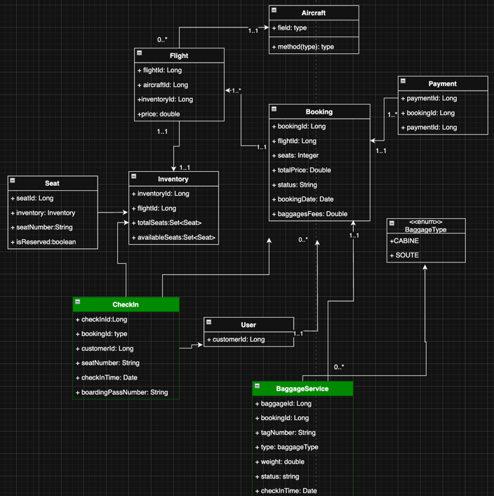

# ✈️ SkyReserve - Microservices-based Flight Reservation System

SkyReserve is a distributed flight booking system developed using **Spring Boot**, **Spring Cloud**, and **Docker**.  
It covers all major processes in a modern airline booking application: flight search, booking, check-in, baggage, payments, and more.

---

## 🧱 Architecture
SkyReserve follows a microservices architecture and includes the following services:




| Service             | Description                                           | Port  |
|---------------------|-------------------------------------------------------|-------|
| `ApiGateway`        | Entry point for all requests, routes to services      | 8080  |
| `ServiceRegistry`   | Eureka server for service discovery                   | 8761  |
| `ConfigServer`      | Centralized configuration management                  | 8888  |
| `FlightService`     | Manage flights, routes, schedules                     | 8081  |
| `AircraftService`   | Aircraft details (type, capacity, etc.)               | 8087  |
| `BookingService`    | Handle passenger bookings                             | 8083  |
| `BaggageService`    | Manage passenger luggage and baggage tags             | 8086  |
| `InventoryService`  | Track seat availability per flight                    | 8082  |
| `CheckInService`    | Passenger check-in process                            | 8084  |
| `PaymentService`    | Process online payments                               | 8085  |
| `NotificationService`| Send emails/SMS notifications to users               | 8088  |
| `AccountingService` | Invoice and financial management                      | 8089  |
| `IdentityService`   | User authentication and account management            | 8090 ---
## 🔌 Ports des Services

Pour faciliter le développement local et les tests, chaque service écoute sur un port spécifique:

| Service               | Port   | URL locale                     |
|-----------------------|--------|--------------------------------|
| ApiGateway            | 8080   | http://localhost:8080          |
| FlightService         | 8081   | http://localhost:8081          |
| InventoryService      | 8082   | http://localhost:8082          |
| BookingService        | 8083   | http://localhost:8083          |
| CheckInService        | 8084   | http://localhost:8084          |
| PaymentService        | 8085   | http://localhost:8085          |
| BaggageService        | 8086   | http://localhost:8086          |
| AircraftService       | 8087   | http://localhost:8087          |
| NotificationService   | 8088   | http://localhost:8088          |
| AccountingService     | 8089   | http://localhost:8089          |
| IdentityService       | 8090   | http://localhost:8090          |
| ServiceRegistry       | 8761   | http://localhost:8761          |
| ConfigServer          | 8888   | http://localhost:8888          |

> **Note**: Pour accéder à la console H2 de chaque service, utilisez l'URL `http://localhost:{PORT}/h2-console` avec les informations de connexion définies dans les fichiers de configuration.

---
## 📡 API Endpoints
### 🎛️ FlightService - Flight Management & Search

| Method   | Endpoint                      | Description                                                 | Parameters                                                                                      |
|----------|-------------------------------|-------------------------------------------------------------|-------------------------------------------------------------------------------------------------|
| `GET`    | `/flights`                    | Retrieve all available flights                              | —                                                                                               |
| `GET`    | `/flights/search`             | Search flights by origin, destination, date, and passengers  | `departureCity` (opt), `arrivalCity` (opt), `date` (opt, ISO format), `numberOfPassengers` (opt) |
| `GET`    | `/flights/{id}`               | Get details of a specific flight by ID                       | `id` (required, Long)                                                                           |
| `GET`    | `/flights/{id}/price`         | Get the price of a specific flight by ID                     | `id` (required, Long)                                                                           |
<br>
✅ Les données dynamiques comme le nombre de sièges disponibles (availableSeats) sont récupérées depuis le InventoryService via un appel interne dans le FlightService.

### 📦 InventoryService - Gestion des Sièges et Disponibilité

| Méthode | Point d'accès | Description | Paramètres/Corps |
|---------|---------------|-------------|------------------|
| `POST` | `/api/inventory` | Crée un nouvel inventaire | Corps: `InventoryRequestDto` (flightId, totalSeats) |
| `GET` | `/api/inventory` | Récupère tous les inventaires | - |
| `GET` | `/api/inventory/check` | Vérifie la disponibilité des sièges | `flightId` (obligatoire)<br>`seatsRequested` (obligatoire) |
| `GET` | `/api/inventory/available-seats` | Obtient le nombre de sièges disponibles | `flightId` (obligatoire) |
| `POST` | `/api/inventory/reserve` | Réserve des sièges | Corps: `SeatReservationRequestDto` (flightId, seats) |
| `POST` | `/api/inventory/release` | Libère des sièges réservés | Corps: `SeatReleaseRequestDto` (flightId, seats) |

### 💳 PaymentService - Traitement des Paiements

| Méthode | Point d'accès | Description | Paramètres/Corps |
|---------|---------------|-------------|------------------|
| `POST` | `/api/payments` | Crée un nouveau paiement | Corps: `PaymentRequestDto` |
| `GET` | `/api/payments/{id}` | Récupère un paiement par ID | `id` (obligatoire) - UUID |
| `GET` | `/api/payments` | Récupère tous les paiements | - |

### ✈️ AircraftService - Gestion des Avions

| Méthode | Point d'accès | Description | Paramètres/Corps |
|---------|---------------|-------------|------------------|
| `GET` | `/api/aircrafts` | Récupère tous les avions | - |
| `GET` | `/api/aircrafts/{id}` | Récupère un avion par ID | `id` (obligatoire) - Long |
| `POST` | `/api/aircrafts` | Crée un nouvel avion | Corps: `AircraftDTO` |
| `PUT` | `/api/aircrafts/{id}` | Met à jour les informations d'un avion | `id` (obligatoire), Corps: `AircraftDTO` |
| `DELETE` | `/api/aircrafts/{id}` | Supprime un avion | `id` (obligatoire) - Long |

### 🎫 BookingService - Gestion des Réservations

| Méthode | Point d'accès | Description | Paramètres/Corps |
|---------|---------------|-------------|------------------|
| `POST` | `/api/bookings` | Crée une nouvelle réservation | Corps: `BookingRequestDto` |
| `GET` | `/api/bookings` | Récupère toutes les réservations | - |

---

## 🚀 How to Run

### 🐳 With Docker Compose

```bash
docker-compose up --build
